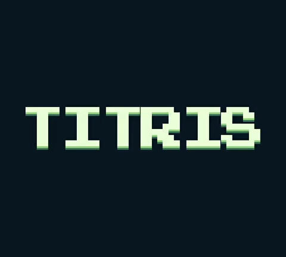

# Titris
Titris is a you-know-what.

## What I can
### 1. To let you play

  

## NOTE:
- [SDL 1.2](https://www.libsdl.org/download-1.2.php) and [SDL_image 1.2](https://www.libsdl.org/projects/SDL_image/release-1.2.html), [SDL_ttf 1.2](https://www.libsdl.org/projects/SDL_ttf/release-1.2.html), [SDL_mixer 1.2](https://www.libsdl.org/projects/SDL_mixer/release-1.2.html) is required.
- `font.ttf` is necessary in `./src/resources`. I recommend **[Press Start 2P](https://fonts.google.com/specimen/Press+Start+2P)** as the font.
- `bgm.ogg` and `se_move.ogg`, `se_rotation.ogg`, `se_shock.ogg` is necessary in `./src/resources`.
